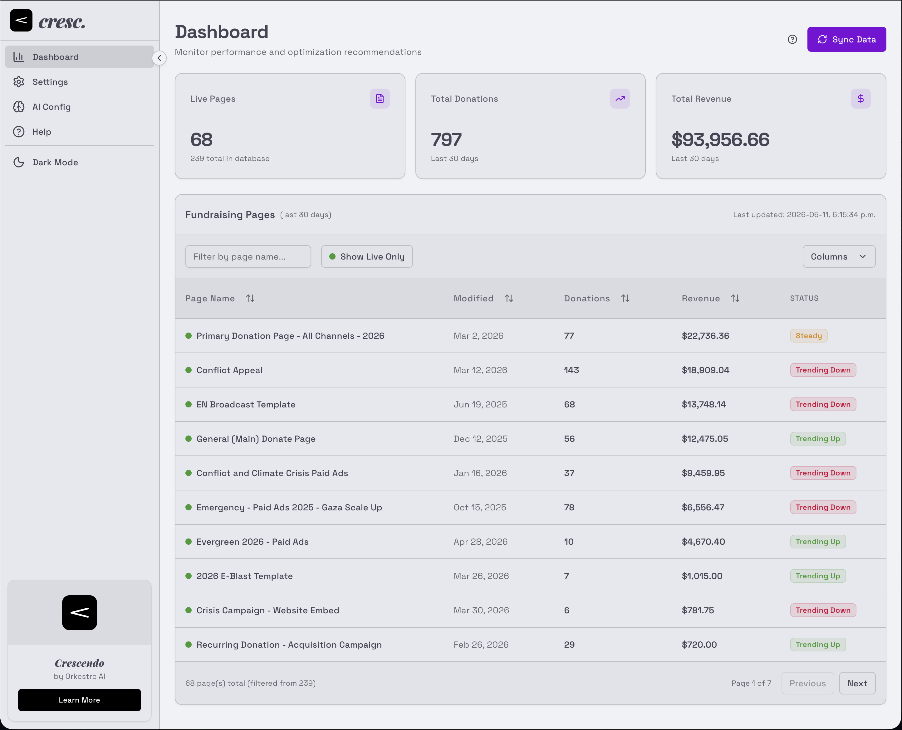
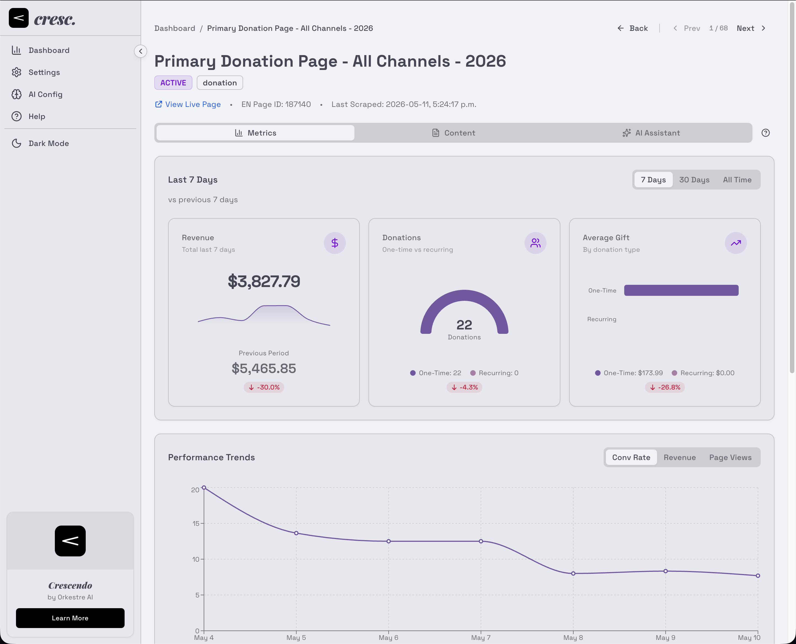
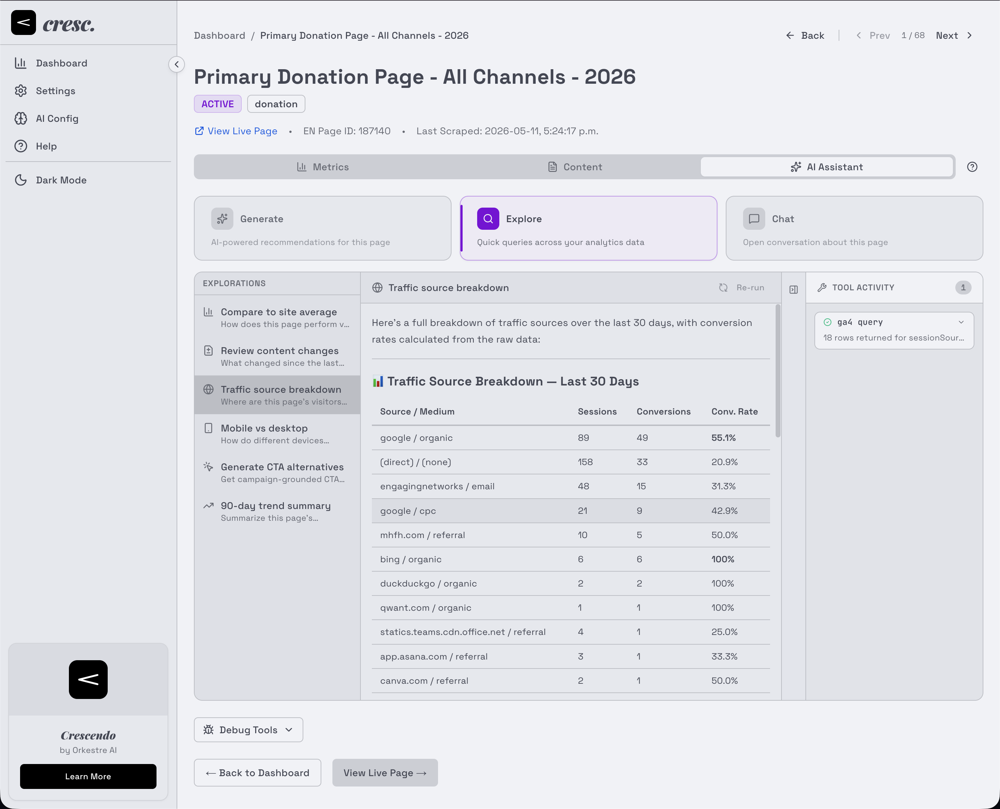

```
                                                                 888          
                                                                 888          
                                                                 888          
 .d8888b 888d888 .d88b.  .d8888b   .d8888b .d88b.  88888b.   .d88888  .d88b.  
d88P"    888P"  d8P  Y8b 88K      d88P"   d8P  Y8b 888 "88b d88" 888 d88""88b 
888      888    88888888 "Y8888b. 888     88888888 888  888 888  888 888  888 
Y88b.    888    Y8b.          X88 Y88b.   Y8b.     888  888 Y88b 888 Y88..88P 
 "Y8888P 888     "Y8888   88888P'  "Y8888P "Y8888  888  888  "Y88888  "Y88P"  
                                                                              
Open-source fundraising page optimizer for Engaging Networks — syncs your donation pages, 
collects analytics, and uses AI to recommend conversion improvements.

Works with Claude, Gemini, OpenAI, or local models through Ollama.  
```

# Crescendo

[](https://github.com/orkestre-ai/crescendo/actions/workflows/ci.yml)
[](LICENSE)
[](CHANGELOG.md)
[](package.json)
[](https://nextjs.org/)
[](https://www.typescriptlang.org/)

---

## Overview

Crescendo helps fundraising teams improve donation page performance without manual analytics work. It connects to your Engaging Networks account, pulls every donation page, layers in Google Analytics 4 metrics and NetDonor revenue data, scrapes page content (with Cloudflare bypass), and asks Claude to recommend changes — all on a daily schedule.

**Who it's for:** Nonprofit digital teams and agencies running fundraising programs on Engaging Networks who want data-driven optimization without paying for enterprise analytics tooling.

**What's different:**

- Fundraising-native — built around EN's REST and Public APIs, not retrofitted from a generic analytics tool.
- AI recommendations grounded in your actual page content and conversion data.
- Self-hosted and open-source — your donor analytics stay in your infrastructure.

## Screenshots


_Dashboard — all fundraising pages with conversion, revenue, and traffic metrics._


_Page detail — campaign metrics, trends, and AI recommendations._


_AI Explorations — configurable query templates for ad-hoc analysis._

## Features

- **Performance Dashboard** — All fundraising pages with conversion rate, revenue, page views, and donation counts.
- **AI Recommendations** — Per-page optimization suggestions generated by Claude, grounded in scraped content + GA4 data.
- **AI Chat & Explorations** — Streaming chat with tool access for ad-hoc analysis, plus configurable query templates.
- **Content Scraping** — Automated page capture with Playwright fallback for Cloudflare-protected pages.
- **Payment Gateway Detection** — Identifies payment processors and methods across all donation pages.
- **Scheduled Data Collection** — Daily QUICK sync (page list + metrics) and nightly DEEP scan (content + AI recs).
- **Multi-Provider AI** — Anthropic, OpenAI-compatible, Google, and Ollama via the Vercel AI SDK.
- **Update Notifications** — In-app banner when a newer GitHub release is available.

## Tech Stack

| Layer | Tech |
|---|---|
| Framework | Next.js 15.5, React 19, TypeScript 5.9 |
| Runtime | Node.js ≥ 20 |
| Database | PostgreSQL (via Docker), Prisma 6.17 ORM |
| Styling | Tailwind CSS 4.1, shadcn/ui, Radix primitives |
| AI | Vercel AI SDK 6, `@ai-sdk/anthropic`, `@ai-sdk/openai`, `@ai-sdk/google`, Ollama |
| Scraping | Playwright 1.58, optional `rebrowser-playwright` for Cloudflare bypass |
| Scheduler | `node-cron` (in-process) |
| Logging | `pino` + `pino-pretty` |
| Validation | `zod` 4.1 |

## Prerequisites

You'll need:

- **Docker Desktop** ([Mac](https://www.docker.com/products/docker-desktop/) / [Windows with WSL 2](https://learn.microsoft.com/en-us/windows/wsl/install))
- **Node.js ≥ 20** (only for local development without Docker)
- **gcloud CLI** _(optional, recommended)_ — only needed if you'd rather run `npm run setup:ga4` than click through the manual GA4 wizard. Install: `brew install --cask google-cloud-sdk` (mac) or [Google's installer](https://cloud.google.com/sdk/docs/install) (Windows/Linux).
- **API credentials**:
  - Engaging Networks REST API token
  - Google Analytics 4 service account JSON
  - Anthropic API key (optional — required for AI features)

See the [Credential Setup Guide](docs/guides/credential-setup.md) for step-by-step instructions on obtaining each.

## Getting Started

### Docker (recommended)

```bash
# 1. Clone
git clone https://github.com/orkestre-ai/crescendo.git
cd crescendo

# 2. Create your environment file
cp .env.example .env

# 3. Edit .env with your API credentials
# (see Configuration below or docs/guides/credential-setup.md)

# 4. Start everything
docker compose up

# 5. Open the dashboard
open http://localhost:3000
```

Docker Compose configures the database connection and runs migrations automatically. No manual DB setup needed.

### Local development (Next.js on host, Postgres in Docker)

```bash
# Guided bootstrap — checks prereqs, installs deps, runs migrations
./setup.sh

# Edit .env.local with your credentials
# (setup.sh copied .env.example → .env.local if it didn't exist)

# Start dev server (hot reload)
npm run start:dev

# Or start production build
npm run start:prod

# Stop everything
npm run shutdown
```

Re-run `npm run doctor` any time to verify environment health.

See [Getting Started](GETTING_STARTED.md) for the full walkthrough.

## Configuration

All environment variables are documented in [`.env.example`](.env.example). Summary:

### Required

| Variable | Default | Description |
|---|---|---|
| `POSTGRES_URL` | (Docker overrides) | PostgreSQL connection string (pooled) |
| `POSTGRES_PRISMA_URL` | (Docker overrides) | Prisma-specific connection |
| `POSTGRES_URL_NON_POOLING` | (Docker overrides) | Used for migrations/seeding |
| `EN_API_TOKEN` | — | Engaging Networks REST API token |
| `EN_BASE_URL` | `https://ca.engagingnetworks.app/ens/service` | EN regional endpoint (ca/us/eu/au) |
| `GA4_PROPERTY_ID` | — | Format: `properties/123456789` |
| `GA4_SERVICE_ACCOUNT_KEY` | — | GA4 service account JSON (single line) |
| `ENCRYPTION_KEY` | — | 64-char hex key for AES-256 credential encryption |

### Optional

| Variable | Default | Description |
|---|---|---|
| `ANTHROPIC_API_KEY` | — | Required for AI recommendations and chat |
| `EN_PUBLIC_TOKEN` | — | EN Public API token (NetDonor fundraising data) |
| `EN_REGION` | `ca` | EN region: `us` or `ca` |
| `NEXT_PUBLIC_APP_URL` | `http://localhost:3000` | Public URL for absolute links |
| `CRON_SECRET` | — | Secret for external cron triggers via `curl` |
| `ENABLE_SCHEDULER` | `true` | In-process scheduler toggle |
| `SCREENSHOT_DIR` | `public/screenshots` | Screenshot output directory |
| `SYNC_DEBUG_LIMIT` | `0` | Limit sync to N most-recent pages (0 = all) |
| `REBROWSER_ENABLED` | `false` | Use `rebrowser-playwright` for stealth scraping |
| `WEBSHARE_PROXY_HOST` | — | Webshare proxy host (residential IP rotation) |
| `WEBSHARE_PROXY_PORT` | — | Webshare proxy port |
| `WEBSHARE_PROXY_USER` | — | Webshare username |
| `WEBSHARE_PROXY_PASS` | — | Webshare password |

Generate `ENCRYPTION_KEY` with:

```bash
node -e "console.log(require('crypto').randomBytes(32).toString('hex'))"
```

## Usage

Once running at `http://localhost:3000`:

- **Dashboard** (`/`) — All pages with metrics, sortable and filterable.
- **Page Detail** (`/pages/[id]`) — Metrics trends, AI recommendations, scraped content snapshots, payment gateway info.
- **Settings** (`/settings`) — Integration credentials (encrypted at rest), AI provider config, exploration templates.
- **AI Chat** — Streaming chat with tool access to your GA4, page performance, and content snapshot data.

### Common commands

```bash
# Build & run
npm run build              # Production build
npm run dev                # Dev server only (use start:dev for full bootstrap)
npm run lint               # ESLint
npm run format             # Prettier
npm run type-check         # tsc --noEmit

# Database
npx prisma studio                       # DB GUI
npx prisma migrate deploy               # Apply pending migrations
npx prisma migrate dev --name <change>  # Author new migration
npm run db:status                       # Migration status

# Logs
npm run logs:tail          # Live app logs
npm run logs:trace         # Trace a job/request through logs

# Tests
npm run test:scripts       # Script unit tests
npm run test:ai-tools      # AI tool integration tests
```

## Architecture

Crescendo runs two background job types:

```
QUICK (daily):    SYNCING → COLLECTING → FINALIZING
DEEP  (nightly):  SCRAPING → GENERATING_RECS → FINALIZING
```

- **QUICK** syncs the page list from EN and collects GA4 metrics + NetDonor fundraising data.
- **DEEP** scrapes page content (Playwright with Cloudflare fallback) and generates Claude recommendations.

Jobs run to completion across all pages; use `POST /api/jobs/{id}/process` for manual recovery.

### External Integrations

| Service | Client | Auth |
|---|---|---|
| EN REST API | `src/lib/engaging-networks.ts` | Bearer token |
| EN Public API | `src/lib/en-public-client.ts` | Query-param token (optional) |
| Google Analytics 4 | `src/lib/google-analytics.ts` | Service account JSON |
| Anthropic Claude | `src/lib/claude.ts` | API key |
| Web scraping | `src/lib/scraper.ts` | None (axios + Playwright fallback) |

See [`docs/TECHNICAL-REFERENCE.md`](docs/TECHNICAL-REFERENCE.md) for full architecture details, data flow, and the API reference.

## API Reference

Internal HTTP API endpoints live under `src/app/api/` — full route list and contracts in [`docs/TECHNICAL-REFERENCE.md`](docs/TECHNICAL-REFERENCE.md).

For external integrations, see:

- [Engaging Networks REST API Reference](docs/api/engaging-networks.md)
- [Google Analytics 4 API Reference](docs/api/google-analytics.md)

## Contributing

Contributions are welcome. See [CONTRIBUTING.md](CONTRIBUTING.md) for development setup, code style, and PR guidelines.

Quick version:

1. Fork the repo and create a feature branch (`git checkout -b feat/your-feature`)
2. Make your changes — TypeScript strict mode, Prettier (single quotes), ESLint clean
3. Run `npm run lint && npm run type-check && npm run test:scripts` before committing
4. Open a PR against `main`

Please also read our [Code of Conduct](CODE_OF_CONDUCT.md).

## License

Crescendo is licensed under the [GNU Affero General Public License v3.0](LICENSE).

The AGPL is a strong copyleft license: if you run a modified version of Crescendo as a network service, you must make your modifications available to your users under the same license.

## Acknowledgements

Built with:

- [Next.js](https://nextjs.org/) and [React](https://react.dev/)
- [Prisma](https://www.prisma.io/) ORM
- [Vercel AI SDK](https://sdk.vercel.ai/) — multi-provider AI streaming
- [shadcn/ui](https://ui.shadcn.com/) — component primitives on Radix
- [Tailwind CSS](https://tailwindcss.com/)
- [Playwright](https://playwright.dev/) — including [rebrowser-playwright](https://github.com/rebrowser/rebrowser-playwright) for stealth scraping
- [Claude](https://www.anthropic.com/claude) by Anthropic — AI recommendations

Created and maintained by [Orkestre AI](https://orkestre.ai). <!-- VERIFY: actual URL -->

## Support

- **Bug reports & feature requests** — please [open an issue](https://github.com/orkestre-ai/crescendo/issues).
- **Security vulnerabilities** — do **not** file a public issue. See [SECURITY.md](SECURITY.md) for the responsible disclosure process.
- **Questions** — use the [Question issue template](https://github.com/orkestre-ai/crescendo/issues/new/choose) or start a [Discussion](https://github.com/orkestre-ai/crescendo/discussions). <!-- VERIFY: enable Discussions in repo settings if you want this link to work -->

---

**Current version:** 0.6.0 (beta) · See [CHANGELOG.md](CHANGELOG.md) for release notes.
